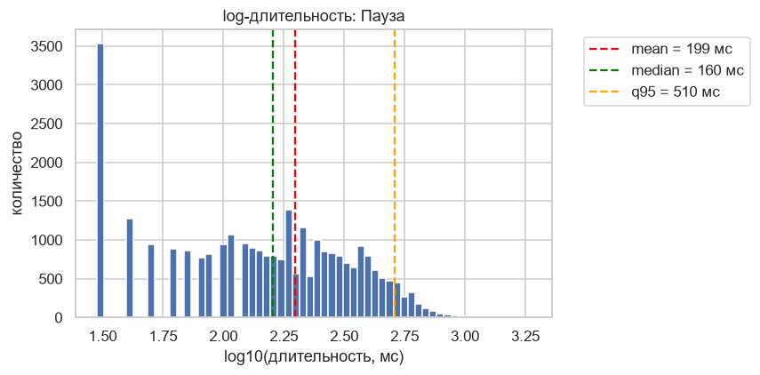
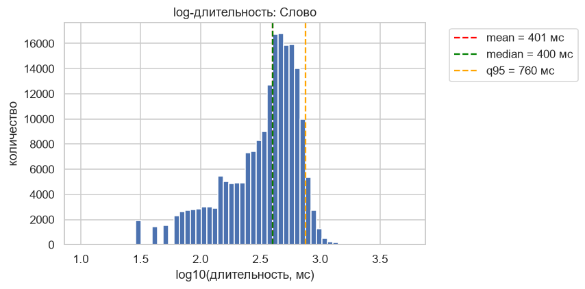
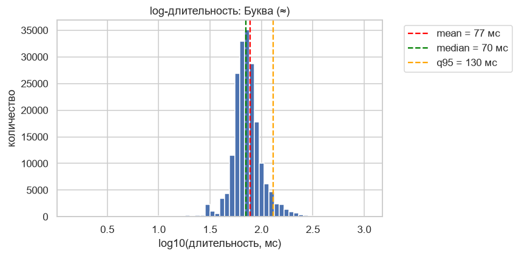
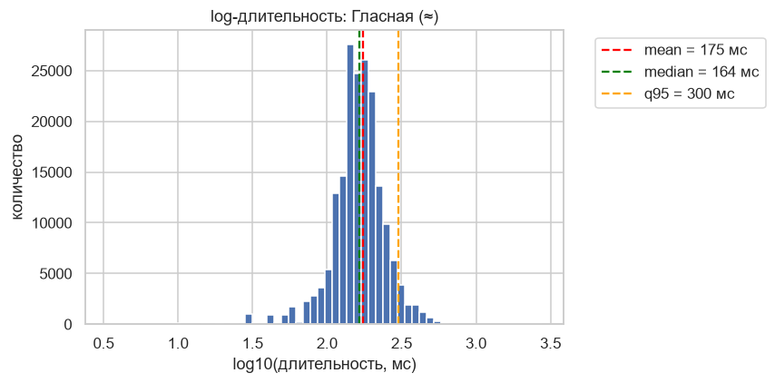
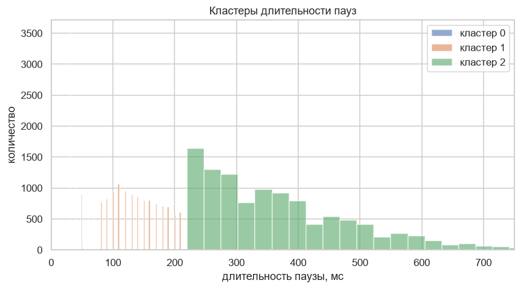

# Лабораторная работа №2. Предсказание пауз

Курс «Синтез речи», Университет ИТМО, 2026

**Выполнил:** Янкин Иван Ю., группа М4221

## 1. Данные и выравнивание

- выравнивание слов и фонем проведено заново (`mfa_align_collab.ipynb`, MFA), так как в исходной разметке было много несостыковок между текстом и TextGrid.

Датасет: 
- 245 609 слов, 21 255 записей. 
- разбиение по номеру записи: `id % 5 == 0` — test (4 249 записей), остальные — train (17 006 записей). 
- последнее слово каждой записи исключено из таргетов и метрик (после него стык файлов, а не естественная пауза). 
- eda проводился на train: 179 704 токенов, из них с паузой 29 451 (16.4%).

## 2. Статистики длительностей

Длительности слова, паузы и фонемы берутся из TextGrid. Длительности буквы и гласной приближённые: длительность слова делится на число букв (гласных) в нём.

| Единица | N | Среднее, мс | Медиана, мс | q95, мс | Std, мс | Мин, мс | Макс, мс |
|---|---|---|---|---|---|---|---|
| Пауза | 29 451 | 198.8 | 160 | 510 | 158.2 | 30 | 1870 |
| Слово | 196 710 | 401.0 | 400 | 760 | 221.8 | 10 | 5558 |
| Буква (≈) | 196 710 | 77.3 | 70.1 | 130 | 33.6 | 1.4 | 1085 |
| Гласная (≈) | 188 678 | 174.7 | 164 | 300 | 71.7 | 3.3 | 2779 |
| Фонема | 1 012 576 | 77.9 | 70 | 150 | 66.6 | 5 | 3730 |

Гистограммы log10-длительности (красная линия — среднее, зелёная — медиана, оранжевая — q95):

| Пауза | Слово |
|---|---|
|  |  |
| **Буква (≈)** | **Гласная (≈)** |
|  |  |

Распределение пауз смещено вправо (среднее 199 мс > медианы 160 мс, длинный хвост до 1.87 с).

### Где появляются паузы

Доля слов с паузой и длительность по классу пунктуации в конце токена (train):

| Класс | Слов | Доля с паузой | Средняя пауза, мс | Медиана, мс |
|---|---|---|---|---|
| period `.` | 10 182 | 0.954 | 224 | 180 |
| ellipsis `…` | 1 863 | 0.930 | 206 | 170 |
| exclaim `!` | 617 | 0.925 | 218 | 180 |
| question `?` | 983 | 0.894 | 216 | 180 |
| closing `)»"` | 429 | 0.748 | 240 | 210 |
| comma `,` | 14 551 | 0.549 | 164 | 100 |
| dash `—` | 8 362 | 0.539 | 198 | 150 |
| none (без знака) | 142 716 | 0.026 | 197 | 180 |
| semicolon `;` | 1 | 1.000 | 720 | 720 |

Паузы в основном логичны: после конца предложения они есть в 89–95% случаев. Запятая и тире дают паузу примерно в половине случаев (зависит от границы клаузы и темпа диктора). Без знака препинания пауза редка (2.6%) и отражает смысловые границы или дыхание.

## 3. Классы пауз

**По пунктуации** (таблица выше): сильные знаки (`.`, `…`, `!`, `?`) почти всегда дают паузу, запятая и тире — примерно в половине случаев, слова без знака — практически никогда. Поэтому в модели сильная пунктуация форсируется правилом.

**По длительности.** KMeans по log-длительности паузы (k выбирался по silhouette: k=2 — 0.602, k=3 — 0.600, при k≥4 падает до ~0.58). Взято k=3:

| Кластер | Паузы | Средняя, мс | Диапазон, мс |
|---|---|---|---|
| 0 — очень короткие | 7 498 | 42 | 30–70 |
| 1 — короткие | 11 209 | 140 | 80–210 |
| 2 — длинные | 10 744 | 370 | 220–1870 |

Кластер 0 (30–70 мс) по длительности близок к техническому шуму выравнивания.

## 4. Корреляции признаков с таргетом

**Классификация (`is_pause_after`).**

- Категориальные, Cramér's V: `punct_class` 0.77, `next_word` 0.59, `prev_word` 0.52, `pos_curr` 0.33, `pos_next1` 0.21, `pos_prev1` 0.18.
- Числовые: `tokens_to_punct` (Pearson −0.39, MI 0.22), `word_len` (0.20), `n_syllables` (0.18), `tokens_since_punct` (0.16), `tokens_to_next_comma` (−0.10). Остальные признаки слабые (MI < 0.02).

**Регрессия (`pause_duration`, только слова с паузой), Спирмен.** Все связи слабые: `pos_in_sentence` 0.18, `sent_len` 0.18, `tokens_since_punct` 0.17, `tokens_to_next_comma` 0.17, остальные < 0.1. Длительность паузы по этим признакам предсказывается заметно хуже, чем её наличие.

## 5. Фильтрация технического шума

Паузы класса `none` (без пунктуации) короче 100 мс или длиннее 400 мс считаются шумом выравнивания MFA и зануляются (`zero_out_noise_pauses` в `prepare_training_data.py`): у слова `is_pause_after = 0`, `pause_duration = 0`, само слово остаётся. Паузы на месте пунктуации не фильтруются при любой длительности.

Дополнительно по итогам анализа важности из признаков удалены пять практически бесполезных (важность < 0.5 в классификаторе и < 0.5 в регрессоре): `is_curr_propn`, `is_curr_noun_or_propn`, `is_next_cconj`, `next_is_stop`, `is_not_last_sentence`. Осталось 21 признак (9 категориальных, 1 бинарный, 11 числовых).

## 6. Анализ результатов

Скрипт `analyze_results.py` обучает модель и выводит:

1. сравнение train/test (признак переобучения);
2. важность признаков классификатора и регрессора;
3. ошибки классификации по классу пунктуации и позиции в предложении;
4. топ-20 худших предсказаний длительности;
5. HTML-страницу «текст + аудио» для прослушивания худших примеров, случайных FN и FP.

Важные признаки:  
- классификатор — `pos_curr` (15.0), `next_word` (14.0), `punct_class` (13.6); 
- регрессор — `sent_len` (16.3), `punct_class` (14.7), `next_word` (7.6).

## 7. Итоговые метрики и ошибки

| Выборка | Precision | Recall | F1 | MAE длительности, мс |
|---|---|---|---|---|
| train | 0.862 | 0.857 | 0.860 | 107.8 |
| test | 0.805 | 0.831 | 0.818 | 115.6 |

Переобучения нет.

**Классификация (test).**

- Запятая: 290 FN и 934 FP. Тире: 79 FN и 338 FP. Модель не всегда различает, где на запятой/тире реально делается пауза.
- Без знака препинания: 858 FN и 23 FP. Модель пропускает паузы в тех местах, где пунктуации нет (смысловые границы, дыхание).
- Сильная пунктуация: FN нет (работает правило), FP немного: пауза в разметке отсутствует.

Вывод: модель ошибается там, где надо предсказать длинную паузу, а не короткую. Признаков не хватает, чтобы отличить длинную точку от короткой.
